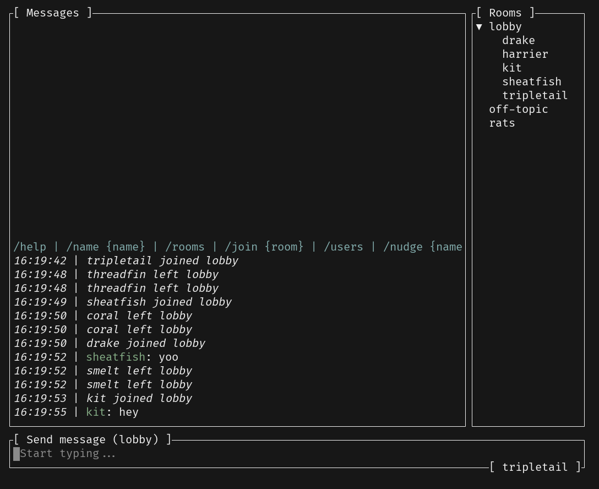
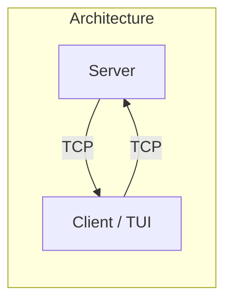
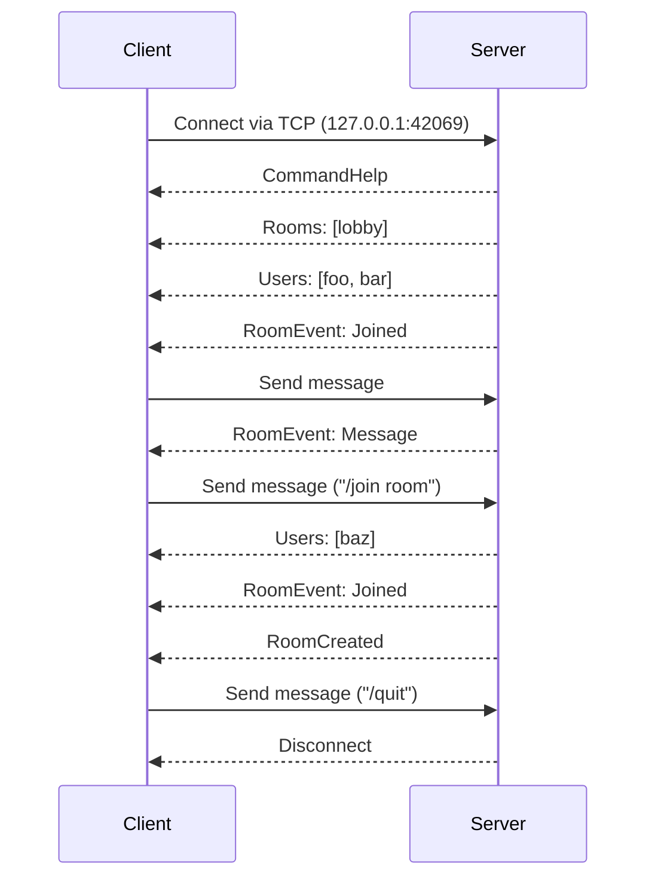

# Ratatui Workshop 👨‍🍳🐀

This workshop is prepared for ["Cooking up with TUIs with Ratatui"](https://rustlab.it/talks/cooking-up-with-tuis-with-ratatui) session at [RustLab 2024](https://rustlab.it).

You can also follow this guide individually and complete the walkthrough. See [Getting Started](#getting-started).

## What will you build?

A terminal chat application that supports sending messages, files, and images.



### Goals

- Get familiar with the fundamentals of [Ratatui](https://ratatui.rs).
- Learn how to incorporate widgets and structure your application.
- Understand the best practices of building TUI applications in Rust.

### Chapters

1. Initialization
2. Text input ([`tui-textarea`](https://github.com/rhysd/tui-textarea))
3. List
4. Scrollbar
5. Tree widget ([`tui-tree-widget`](https://github.com/EdJoPaTo/tui-rs-tree-widget))
6. Popups
7. File explorer ([`ratatui-explorer`](https://github.com/tatounee/ratatui-explorer))
8. Rendering images ([`ratatui-image`](https://crates.io/crates/ratatui-image))
9. Markdown preview ([`tui-markdown`](https://github.com/joshka/tui-markdown))
10. Terminal effects ([`tachyonfx`](https://github.com/junkdog/tachyonfx))
11. Logging ([`tui-logger`](https://github.com/gin66/tui-logger))
12. Testing ([`insta`](https://github.com/mitsuhiko/insta))
13. Customizations

### Architecture





## Getting Started

### Prerequisites

1. [Rust](https://www.rust-lang.org/tools/install) (make sure you have the latest stable version installed).

2. A code editor with [`rust-analyzer`](https://rust-analyzer.github.io/) plugin (or anything at your preference).

3. A performant terminal with image rendering support (is good to have). We recommend [`wezterm`](https://wezfurlong.org/wezterm/).

### Setup

Simply start by cloning this repository:

```sh
git clone https://github.com/orhun/rustlab2024
```

The repository contains a [cargo workspace](https://doc.rust-lang.org/cargo/reference/workspaces.html) with the following crates:

- `server`: A TCP server that handles the communication between clients.
- `common`: Shared types (e.g. commands, events) for the server and client.

Your job is to implement the terminal client for this chat application using Ratatui!

### Start cooking!

TODO

## References

- [Ratatui documentation](https://ratatui.rs/)
- [Rust documentation](https://doc.rust-lang.org/std/)

The client/server architecture is inspired by @pretzelhammer's [chat server](https://github.com/pretzelhammer/chat-server) project.

## License

Copyright © 2024, [Orhun Parmaksız](mailto:orhunparmaksiz@gmail.com)

Licensed under either [The MIT License](./LICENSE)

🦀 ノ( º \_ º ノ) - respect crables!
