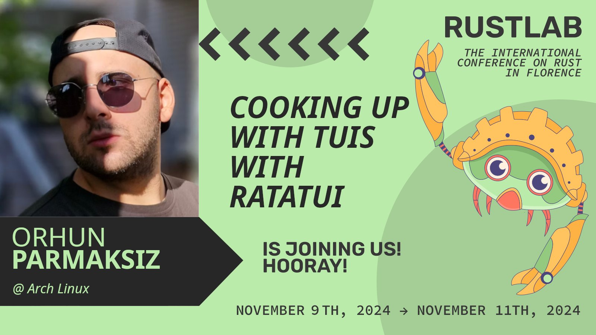

# Ratatui Workshop 👨‍🍳🐀

This workshop is prepared for ["Cooking up with TUIs with Ratatui"](https://rustlab.it/talks/cooking-up-with-tuis-with-ratatui) session at [RustLab 2024](https://rustlab.it).

You can also follow this guide individually and complete the workshop. See [Getting Started](#getting-started).

## What will you build?

A terminal chat application that supports sending messages, files, and images.


### Goals

- Get familiar with the fundamentals of [Ratatui](https://ratatui.rs).
- Learn how to incorporate widgets and structure your application.
- Understand the best practices of building TUI applications in Rust.

### Chapters

0. [Introduction](./workshop/00_intro.md)
1. [Initializing the project](./workshop/01_init.md)
2. [Initializing the TUI](./workshop/02_tui.md)
3. [Server connection](./workshop/03_connection.md)
4. [Message list](./workshop/04_message_list.md)
5. [Text input](./workshop/05_text_input.md) (w/ [`tui-textarea`](https://github.com/rhysd/tui-textarea))
6. [Room list](./workshop/06_room_list.md) (w/ [`tui-tree-widget`](https://github.com/EdJoPaTo/tui-rs-tree-widget))
7. [Help popup](./workshop/07_help_popup.md)
8. [File explorer](./workshop/08_file_explorer.md) (w/ [`ratatui-explorer`](https://github.com/tatounee/ratatui-explorer))
9. [Image preview](./workshop/09_image_preview.md) (w/ [`ratatui-image`](https://crates.io/crates/ratatui-image))
10. [Markdown preview](./workshop/10_markdown_preview.md) (w/ [`tui-markdown`](https://github.com/joshka/tui-markdown))
11. [Terminal effects](./workshop/11_effects.md) (w/ [`tachyonfx`](https://github.com/junkdog/tachyonfx))
12. [Logging](./workshop/12_logging.md) (w/ [`tui-logger`](https://github.com/gin66/tui-logger))
13. [Testing](./workshop/13_testing.md) (w/ [`insta`](https://github.com/mitsuhiko/insta))
14. [End](./workshop/14_end.md)

## Getting Started

### Prerequisites

1. [Rust](https://www.rust-lang.org/tools/install) (make sure you have the latest stable version installed).

2. A code editor with [`rust-analyzer`](https://rust-analyzer.github.io/) plugin (or anything at your preference).

3. A performant terminal with image rendering support (is good to have). We recommend [`wezterm`](https://wezfurlong.org/wezterm/).

### Setup

Simply start by cloning this repository:

```sh
git clone https://github.com/orhun/rustlab2024-ratatui-workshop
```

Your job is to implement a terminal client for a chat application using Ratatui!

[Click here to start the workshop](./workshop/00_intro.md)! ➡️

Start reading through the chapters and sometimes you will be asked to implement some parts of the application. Don't worry, the solutions are also provided! :)

## References

- [Ratatui documentation](https://ratatui.rs/)
- [Rust documentation](https://doc.rust-lang.org/std/)

The client/server architecture is inspired by @pretzelhammer's [chat server](https://github.com/pretzelhammer/chat-server) project.

## License

Copyright © 2024, [Orhun Parmaksız](https://github.com/orhun)

Licensed under [The MIT License](./LICENSE)

🦀 ノ( º \_ º ノ) - respect crables!
