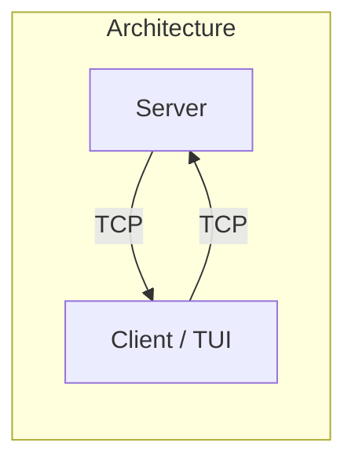
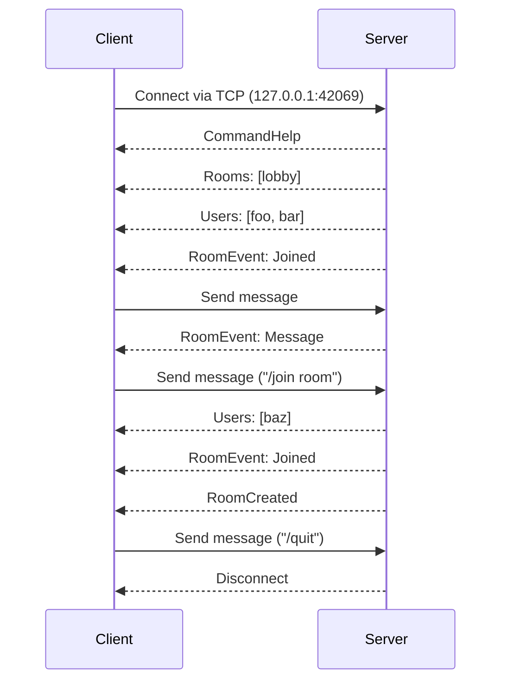

# Introduction

Welcome to the Ratatui workshop! 👋

You will learn to cook up a TUI from the ground up and create your very own IRC-like chat client! 👨‍🍳

Let's start!

## Workshop Format

The workshop is divided into chapters, each focusing on a specific part of the application and they build upon each other. See the [chapters](../README.md#chapters) for more details.

Each chapter is in its own branch:

- `chapter-N`: Contains the code with incomplete parts.
- `chapter-N-solution`: Contains the full solution to move on to the next chapter.

Replace `N` with the chapter number (e.g. `chapter-5`)

The recommended way of following the workshop is:

1. Checkout the chapter branch:

```sh
git merge origin/chapter-N
```

2. Read through the chapter and implement the missing parts. You can get help from the provided hints and solutions.

3. When you are done, either merge the solution branch (and resolve conflicts if any):

```sh
git merge origin/chapter-N-solution
```

Or discard your changes and merge the solution branch:

```sh
# This is useful if you don't want to deal with conflicts
git merge -X theirs origin/chapter-N-solution
```

4. Ask questions (submit issues) if you are stuck or need help!

## Repository Structure

The repository contains a [cargo workspace](https://doc.rust-lang.org/cargo/reference/workspaces.html) with the following crates:

- [`server`](../server): A TCP server that handles the communication between clients.
- [`common`](../common): Shared types (e.g. commands, events) for the server and client.

The server part is already implemented, so you can only focus on the client. But we are not going to stop you from taking a peek at the server code if you are interested! :)

### Testing out the server

We are assuming that you have already installed the latest stable version of Rust. If not, please check out the [prerequisites](../README.md).

To test out the server, you can run the following command on a terminal:

```sh
cargo run -p server
```

The server will start listening for connections at `127.0.0.1:42069`. If you want to change the port, use the `--ip` and `--port` flags.

Then on another terminal, you can connect to the server using [Netcat](https://en.wikipedia.org/wiki/Netcat) (`nc`):

```sh
nc 127.0.0.1 42069
```

You can then type in commands like `/help`, `/join room`, `/quit`, etc. to interact with the server.

```log
{"CommandHelp":["perch","/help | /name {name} | /rooms | /join {room} | /users | /nudge {name} | /quit"]}
{"Rooms":[["lobby",1]]}
{"Users":["perch"]}
{"RoomEvent":{"room_name":"lobby","username":"perch","date":"21:36:13","event":{"Joined":"lobby"}}}
/help
{"CommandHelp":["perch","/help | /name {name} | /rooms | /join {room} | /users | /nudge {name} | /quit"]}
/join test
{"Users":["perch"]}
{"RoomCreated":"test"}
{"RoomEvent":{"room_name":"test","username":"perch","date":"21:36:20","event":{"Joined":"test"}}}
/quit
"Disconnect"
```

You can see that the server uses the JSON format for the responses. As an additional point, it uses base64 encoding for the byte data. This will come important later.

### Server Commands

Here is the list of server commands that we are going to implement in the client:

| Command         | Syntax                    | Description                                 |
| --------------- | ------------------------- | ------------------------------------------- |
| Help            | `/help`                   | Displays help information                   |
| Change Username | `/name <username>`        | Changes the username to `<username>`        |
| List Rooms      | `/rooms`                  | Lists available chat rooms                  |
| Join Room       | `/join <roomname>`        | Joins the specified `<roomname>`            |
| List Users      | `/users`                  | Lists users in the current room             |
| Send File       | `/file <filename> <data>` | Sends a file with `<filename>` and `<data>` |
| Nudge User      | `/nudge <username>`       | Sends a nudge to `<username>`               |
| Quit            | `/quit`                   | Exits the chat                              |

See the [`common`](../common) crate for more details.

### Architecture

The architecture diagram is shown below:



Sequence diagram of a typical client-server interaction (some events are omitted/shortened for brevity):



---

<div style="text-align: right">

Continue to the [next chapter](./01_init.md) to get started with the project. ➡️

</div>
