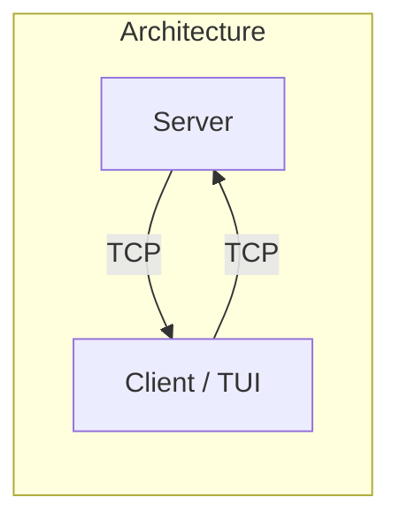
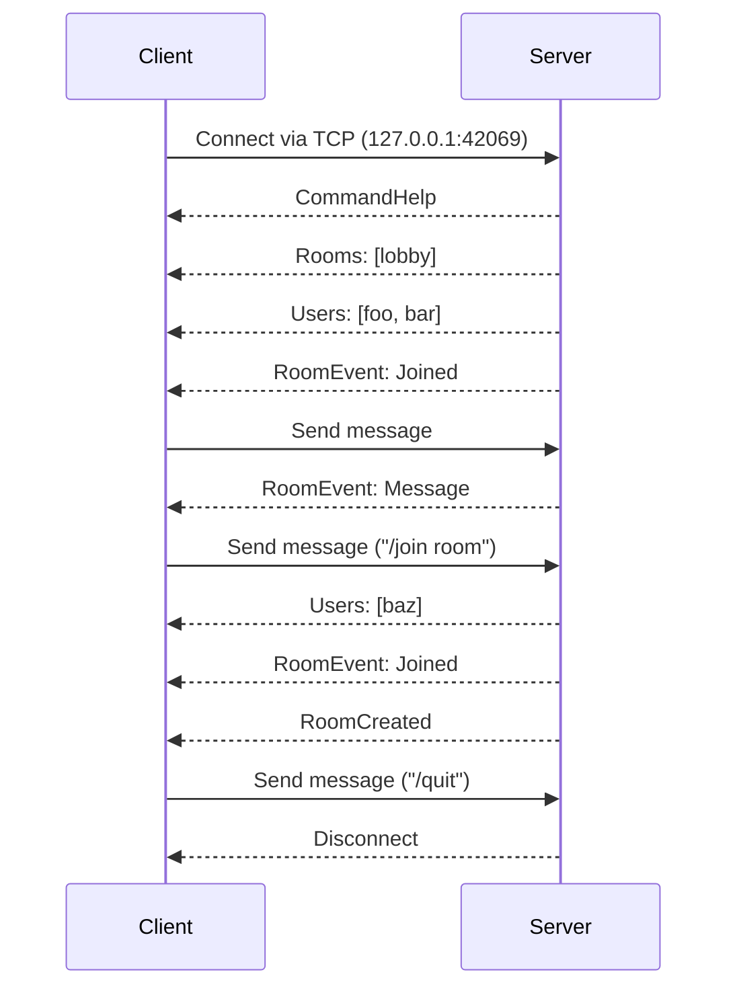

# Introduction

Welcome to the workshop! 👋

You will learn to cook up a TUI from the ground up and create your very own IRC-like chat client! 👨‍🍳

The repository contains a [cargo workspace](https://doc.rust-lang.org/cargo/reference/workspaces.html) with the following crates:

- [`server`](../server): A TCP server that handles the communication between clients.
- [`common`](../common): Shared types (e.g. commands, events) for the server and client.

The server part is already implemented, so you can only focus on the client. But we are not going to stop you from taking a peek at the server code if you are interested :)

## Testing out the server

We are assuming that you have already installed the latest stable version of Rust. If not, please follow the presequites in the [README](../README.md).

To test out the server, you can run the following command on one terminal:

```sh
cargo run -p server
```

The server will start listening for connections at `127.0.0.1:42069`. If you want to change the port, use the `--ip` and `--port` flags.

Then on another terminal, you can connect to the server using [Netcat](https://en.wikipedia.org/wiki/Netcat) (`nc`):

```sh
nc 127.0.0.1 42069
```

You can then type in commands like `/help`, `/join room`, `/quit`, etc. to interact with the server.

```log
{"CommandHelp":["perch","/help | /name {name} | /rooms | /join {room} | /users | /nudge {name} | /quit"]}
{"Rooms":[["lobby",1]]}
{"Users":["perch"]}
{"RoomEvent":{"room_name":"lobby","username":"perch","date":"21:36:13","event":{"Joined":"lobby"}}}
/help
{"CommandHelp":["perch","/help | /name {name} | /rooms | /join {room} | /users | /nudge {name} | /quit"]}
/join test
{"Users":["perch"]}
{"RoomCreated":"test"}
{"RoomEvent":{"room_name":"test","username":"perch","date":"21:36:20","event":{"Joined":"test"}}}
/quit
"Disconnect"
```

You can see that the server uses the JSON format for the responses. As an additional point, it uses base64 encoding for the byte data. This will come important later.

## Architecture

The architecture diagram is shown below:



Sequence diagram of a typical client-server interaction (some events are omitted/shortened for brevity):


