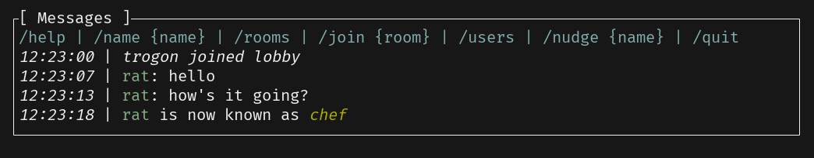

# Message List

Let's build this list widget for displaying the messages that we receive from the server:



## Implementing the Widget

When it comes to adding new widgets, the approach that we will follow is:

1. Create a new module for the widget.
2. Implement the [`Widget`](https://docs.rs/ratatui/latest/ratatui/widgets/trait.Widget.html) trait.

Based on this, we can start designing our widget state in `src/message_list.rs` (don't forget to add `mod message_list;` to `src/app.rs`):

```rust
use common::{RoomEvent, RoomName, ServerEvent, Username};

#[derive(Debug, Clone, Default)]
pub struct MessageList {
    pub events: Vec<ServerEvent>,
    pub room_name: RoomName,
    pub username: Username,
}
```

The `MessageList` struct will hold the messages that we receive from the server, the room name, and the username of the user. We will use this information to display the messages in the Ratatui's [`List`](https://docs.rs/ratatui/latest/ratatui/widgets/struct.List.html) widget.

So let's implement the `Widget` trait for the `MessageList` struct:

```rust
use ratatui::{
    buffer::Buffer,
    layout::Rect,
    style::{Color, Modifier, Style, Stylize},
    text::{Line, Span},
    widgets::{Block, List, ListDirection, ListItem, Widget},
};

impl Widget for &mut MessageList {
    fn render(self, area: Rect, buf: &mut Buffer) {
        let items = self
            .events
            .iter()
            .rev()
            .filter_map(|event| self.server_event_line(event))
            .map(ListItem::new)
            .collect::<Vec<_>>();

        let list = List::new(items)
            .block(Block::bordered().title("[ Messages ]"))
            .highlight_style(Style::default().add_modifier(Modifier::BOLD))
            .highlight_symbol("> ")
            .repeat_highlight_symbol(true)
            .direction(ListDirection::BottomToTop);

        Widget::render(list, area, buf);
    }
}
```

The render logic consists of these steps:

1. We iterate over the `events` vector (in reverse order) and create styled [`ListItem`](https://docs.rs/ratatui/latest/ratatui/widgets/struct.ListItem.html)s for each event (with the help of the `server_event_line` method which we will implement next).
2. We create a `List` widget with the items and set the styling options such as the block title, highlight style, and direction.

So let's implement the `server_event_line` method:

```rust
impl MessageList {
    fn server_event_line<'a>(&self, event: &'a ServerEvent) -> Option<Line<'a>> {
        match event {
            ServerEvent::CommandHelp(_, contents) => Some(Line::from(contents.as_str()).blue()),
            ServerEvent::RoomEvent {
                room_name: _,
                username,
                date,
                event,
            } => self.room_event_line(username.clone(), date, event),
            ServerEvent::Error(error) => Some(Line::from(format!("Error: {error}")).red()),
            _ => None,
        }
    }
}
```

Here we pattern match on the `ServerEvent` enum and return a styled `Line` for each event type. For example, if the event is a `CommandHelp` event, we return a blue colored line with the events. Calling `.blue()` is possible thanks to the [`Stylize`](https://docs.rs/ratatui/latest/ratatui/style/trait.Stylize.html) trait of Ratatui :)

We also call the `room_event_line` method for `RoomEvent` events. Let's implement it:

```rust
impl MessageList {
  // ...

    fn room_event_line<'a>(
        &self,
        username: Username,
        date: &'a str,
        event: &'a RoomEvent,
    ) -> Option<Line<'a>> {
        match event {
            RoomEvent::Message(message) => {
                let color = if username == self.username {
                    Color::Yellow
                } else {
                    Color::Cyan
                };
                Some(Line::from_iter([
                    date.italic(),
                    " | ".into(),
                    Span::from(username).style(color),
                    ": ".into(),
                    message.into(),
                ]))
            }
            RoomEvent::Joined(room) => Some(Line::from(vec![
                date.italic(),
                " | ".into(),
                format!("{username} joined {room}").italic(),
            ])),
            RoomEvent::Left(room) => Some(Line::from(vec![
                date.italic(),
                " | ".into(),
                format!("{username} left {room}").italic(),
            ])),
            RoomEvent::NameChange(name) => Some(Line::from(vec![
                date.italic(),
                " | ".into(),
                Span::from(username).cyan(),
                " is now known as ".into(),
                Span::from(name).green().italic(),
            ])),
            _ => None,
        }
    }
}
```

Here we are doing a bit more complex styling. For example, we are using different colors for the messages based on the username. We are also using the `italic` modifier for the date and the messages. This will make the messages look more appealing.

The way that `Line` is constructed is by using the `from` method which takes a Vector of [`Span`](https://docs.rs/ratatui/latest/ratatui/text/struct.Span.html)s.

- Each `Span` can have a different style.
- We can also use the `into` method to convert a String into a `Span`.
- Chaining the styling methods (e.g. `.cyan().italic()`) on a String will return a `Span` with the specified style.

## Using the Widget

As the next step, we need to incorporate our custom `MessageList` widget into the `App` struct. Let's do that in `src/app.rs`:

```diff
-use common::Command;
+use common::{Command, RoomEvent, RoomName, ServerEvent, Username};
 use crossterm::event::{Event, EventStream, KeyCode};
 use futures::{SinkExt, StreamExt};
 use ratatui::DefaultTerminal;
@@ -6,11 +6,15 @@ use std::net::SocketAddr;
 use tokio::net::{tcp::OwnedWriteHalf, TcpStream};
 use tokio_util::codec::{FramedRead, FramedWrite, LinesCodec};

+use crate::message_list::MessageList;
+
 pub struct App {
     addr: SocketAddr,
     term_stream: EventStream,
     is_running: bool,
     tcp_writer: Option<FramedWrite<OwnedWriteHalf, LinesCodec>>,
+    // UI components
+    pub message_list: MessageList,
 }

 impl App {
@@ -21,6 +25,7 @@ impl App {
             term_stream,
             is_running: false,
             tcp_writer: None,
+            message_list: MessageList::default(),
         }
     }

@@ -33,8 +38,7 @@ impl App {
         self.tcp_writer = Some(FramedWrite::new(writer, LinesCodec::new()));

         while self.is_running {
-            terminal.draw(|frame| frame.render_widget("Hello Ratatui!", frame.area()))?;
-
+            terminal.draw(|frame| frame.render_widget(&mut self.message_list, frame.area()))?;
             tokio::select! {
                 Some(crossterm_event) = self.term_stream.next() => {
                     let crossterm_event = crossterm_event?;
@@ -47,9 +51,53 @@ impl App {
                         }
                     }
                 },
-                Some(_tcp_event) = tcp_reader.next() => {}
+                Some(tcp_event) = tcp_reader.next() => self.handle_server_event(tcp_event?).await?,
+            }
+        }
+        Ok(())
+    }
```

## Handling Server Events

As you can see, rendering the widget is as simple as giving it to the `render_widget` method. For updating it's state, we need to handle some server events (`handle_server_event`).

Simply add these two functions to the `impl App` block:

```rust

impl App {
  // ...

    pub async fn handle_server_event(&mut self, event: String) -> anyhow::Result<()> {
        let event = ServerEvent::from_json_str(&event)?;
        self.message_list.events.push(event.clone());
        match event {
            ServerEvent::CommandHelp(username, _help) => self.message_list.username = username,
            ServerEvent::RoomEvent {
                room_name,
                username,
                event,
                ..
            } => self.handle_room_event(room_name, username, event).await,
            ServerEvent::Error(_error) => {}
            ServerEvent::Disconnect => {
                self.is_running = false;
            }
            ServerEvent::RoomCreated(_) => {}
            ServerEvent::RoomDeleted(_) => {}
            ServerEvent::Rooms(_) => {}
            ServerEvent::Users(_) => {}
        }
        Ok(())
    }

    async fn handle_room_event(
        &mut self,
        _room_name: RoomName,
        username: Username,
        room_event: RoomEvent,
    ) {
        match room_event {
            RoomEvent::Message(_message) => {}
            RoomEvent::Joined(room) | RoomEvent::Left(room) => {
                self.message_list.room_name = room.clone();
            }
            RoomEvent::NameChange(new_username) => {
                if username == self.message_list.username {
                    self.message_list.username = new_username;
                }
            }
            RoomEvent::Nudge(_) => {}
            RoomEvent::File { .. } => {}
        }
    }
}
```

You can see that we are matching on specific server events and updating the `message_list` state accordingly. For example, when we receive a `RoomEvent` with a `Joined` or `Left` event, we update the `room_name` field. Or similarly, when we receive a `CommandHelp` event, we update the `username` field.

In the next chapters, we will be implementing the rest of these events :) But for now, if you run the TUI application, you should see the server messages displayed in the list widget.
