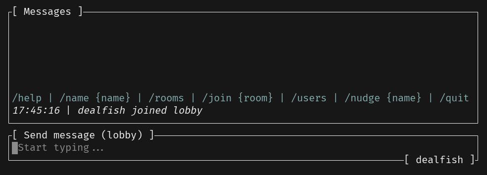

# Text Input

Although we can see the messages coming from the server, we can't send any messages yet. Let's add a text input widget to the TUI so that we can start sending messages.



## Handling User Input

It is possible to implement an user input widget from scratch (via controlling the terminal cursor etc.), but we will be using [`tui-textarea`](https://github.com/rhysd/tui-textarea) for more functional text input handling.

```sh
cargo add tui-textarea@0.6.1
```

---

🎯 **Task**: Implement the `create_text_area` function which returns a new `TextArea` widget.

```rust
fn create_text_area() -> TextArea<'static> {
    // ...
}
```

💡 **Tip:** See the [documentation](https://docs.rs/tui-textarea/latest/tui_textarea/struct.TextArea.html) for more information.

<details>
<summary><b>Solution</b> ✅</summary>

```rust
fn create_text_area() -> TextArea<'static> {
    let mut text_area = TextArea::default();
    text_area.set_cursor_line_style(Style::default());
    text_area.set_placeholder_text("Start typing...");
    text_area
}
```

</details>

---

Then we can add the widget to our `App` struct in `src/app.rs`:

```diff
 use common::{Command, RoomEvent, RoomName, ServerEvent, Username};
-use crossterm::event::{Event, EventStream, KeyCode};
+use crossterm::event::EventStream;
 use futures::{SinkExt, StreamExt};
-use ratatui::DefaultTerminal;
+use ratatui::{style::Style, DefaultTerminal};
 use std::net::SocketAddr;
 use tokio::net::{tcp::OwnedWriteHalf, TcpStream};
 use tokio_util::codec::{FramedRead, FramedWrite, LinesCodec};
+use tui_textarea::{Input, Key, TextArea};

 use crate::message_list::MessageList;

+fn create_text_area() -> TextArea<'static> { /* Implemented above */ }
+
 pub struct App {
     addr: SocketAddr,
     term_stream: EventStream,
@@ -15,6 +23,7 @@ pub struct App {
     tcp_writer: Option<FramedWrite<OwnedWriteHalf, LinesCodec>>,
     // UI components (these need to be public as we define the draw_ui method not in a child module)
     pub message_list: MessageList,
+    pub text_area: TextArea<'static>,
 }

 impl App {
@@ -26,6 +35,7 @@ impl App {
             is_running: false,
             tcp_writer: None,
             message_list: MessageList::default(),
+            text_area: create_text_area(),
         }
     }

```

`tui-textarea` provides a conversion between raw `crossterm` events and its [`Input`](https://docs.rs/tui-textarea/latest/tui_textarea/struct.Input.html) type which is more convenient to work with.

This means that we no longer have to match on `KeyCode` and `Event` types in the event stream. Let's refactor the event handling code to use `Input` instead:

```diff
                 Some(crossterm_event) = self.term_stream.next() => {
                     let crossterm_event = crossterm_event?;
-                    if let Event::Key(key_event) = crossterm_event {
-                        if key_event.code == KeyCode::Esc {
-                            if let Some(writer) = self.tcp_writer.as_mut() {
-                                let _ = writer.send(Command::Quit.to_string()).await;
-                            }
-                            self.is_running = false;
-                        }
-                    }
+                    let input = Input::from(crossterm_event.clone());
+                    self.handle_key_input(input).await?;
                 },
                 Some(tcp_event) = tcp_reader.next() => self.handle_server_event(tcp_event?).await?,
             }
@@ -57,6 +61,32 @@ impl App {
         Ok(())
     }
```

---

🎯 **Task**: Implement the `handle_key_input` method which handles the `Input` events.

```rust
impl App {
    async fn handle_key_input(&mut self, input: Input) -> anyhow::Result<()> {
        // ...
    }
}
```

- 💡 **Tip:**
  - Send `Command::Quit` to the server when the `Esc` key is pressed.
  - Call the `send_message` method when the `Enter` key is pressed.
  - Pass the rest of the keys to the `TextArea` widget.

<details>
<summary><b>Solution</b> ✅</summary>

```rust
impl App {
  // ...
    async fn handle_key_input(&mut self, input: Input) -> anyhow::Result<()> {
        match input.key {
            Key::Esc => {
                if let Some(writer) = self.tcp_writer.as_mut() {
                    let _ = writer.send(Command::Quit.to_string()).await;
                }
            }
            Key::Enter => self.send_message().await?,
            _ => {
                let _ = self.text_area.input_without_shortcuts(input);
            }
        }
        Ok(())
    }
}
```

As seen above, we are handling the `Esc` and `Enter` keys. For the rest of the keys, we are passing them to the `input_without_shortcuts` method of the `TextArea` widget which is used to handle the input events.

</details>

---

---

🎯 **Task**: Implement the `send_message` method which sends the message to the server.

```rust
impl App {
    async fn send_message(&mut self) -> anyhow::Result<()> {
        // ...
    }
}
```

- 💡 **Tip:** Use `tcp_writer` and `text_area.into_lines()` :)

<details>
<summary><b>Solution</b> ✅</summary>

To implement `send_message`, we can simply use `tcp_writer` to send each line to the server and clear the text area afterwards:

```rust
impl App {
  // ...
    async fn send_message(&mut self) -> anyhow::Result<()> {
        if let Some(writer) = self.tcp_writer.as_mut() {
            if !self.text_area.is_empty() {
                for line in self.text_area.clone().into_lines() {
                    writer.send(line).await?;
                }
                self.text_area.select_all();
                self.text_area.delete_line_by_end();
            }
        }
        Ok(())
    }
}
```

</details>

---

## Rendering the Text Input

Our UI rendering code will get larger as we add more widgets. It's a good time to move it to a separate method/file :)

```diff
@@ -38,18 +48,12 @@ impl App {
         self.tcp_writer = Some(FramedWrite::new(writer, LinesCodec::new()));

         while self.is_running {
-            terminal.draw(|frame| frame.render_widget(&mut self.message_list, frame.area()))?;
+            terminal.draw(|frame| self.draw_ui(frame))?;
             tokio::select! {
```

---

🎯 **Task**: Implement the `draw_ui` method.

```rust
impl App {
    pub fn draw_ui(&mut self, frame: &mut Frame) {
        // ...
    }
}
```

💡 **Tip:**

- Create a new file `src/ui.rs` and implement the `draw_ui` method there (don't forget to add `mod ui;` to `src/main.rs`):
- Use the [`Layout`](https://docs.rs/ratatui/latest/ratatui/layout/struct.Layout.html) to split the available area into two parts:
  - one for the message list and the other for the text area.
- Set the title of the `text_area` widget to display the current room name and username using `set_block` and `Block` widget.

<details>
<summary><b>Solution</b> ✅</summary>

```rust
use ratatui::{
    layout::{Constraint, Layout},
    text::Line,
    widgets::Block,
    Frame,
};

use crate::app::App;

impl App {
    pub fn draw_ui(&mut self, frame: &mut Frame) {
        let [message_area, text_area] =
            Layout::vertical([Constraint::Fill(1), Constraint::Max(3)]).areas(frame.area());

        self.text_area.set_block(
            Block::bordered()
                .title(format!(
                    "[ Send message ({}) ]",
                    self.message_list.room_name
                ))
                .title_bottom(
                    Line::from(format!("[ {} ]", self.message_list.username)).right_aligned(),
                ),
        );
        frame.render_widget(&self.text_area, text_area);
        frame.render_widget(&mut self.message_list, message_area);
    }
}
```

The most important line here is:

```rust
let [message_area, text_area] =
    Layout::vertical([Constraint::Fill(1), Constraint::Max(3)]).areas(frame.area());
```

It splits the available area into two parts. The `message_area` will take up all the available space except for the last 3 lines which will be reserved for the `text_area`. See the [constraints documentation](https://ratatui.rs/concepts/layout/#constraints) for more details.

Also, we are setting titles for the `text_area` widget for e.g. displaying the current room name and username.

And the rest is simply rendering the widgets in their respective areas.

</details>

---

If you run the TUI now, you should be able to send messages to the server and chat with other users! 🚀
