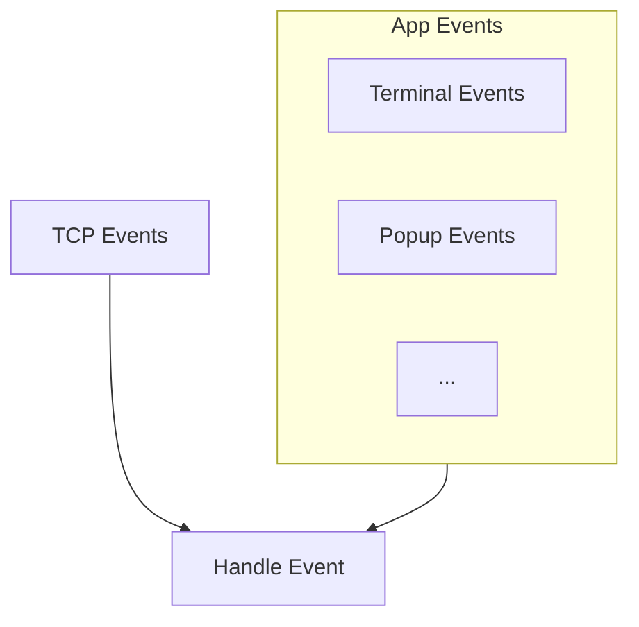

# Help Popup

There are a various ways of adding a help menu to the TUI applications. For example, you can display the key bindings at the bottom of the screen or prefer to have an individual pane for them.

In this chapter, we will implement a popup window that displays the key bindings (or any other help text you prefer) when the user presses the `Ctrl-h` key combination.


This chapter is also important to follow because we will be using the same popup mechanism for the next widget we are going to implement.

## Refactoring Event Handling

Now, here is a question to ponder: when we display the help popup, how the event handling should work?

The answer depends on your project structure, but we are going to design this in a way that the help popup will be able to communicate with the main application, very much like the terminal events. In other words, we will support sending events **within** the application.



Take a look at this refactor:

```diff
 use common::{Command, RoomEvent, RoomName, ServerEvent, Username};
-use crossterm::event::EventStream;
+use crossterm::event::{Event as CrosstermEvent, EventStream};
 use futures::{SinkExt, StreamExt};
 use ratatui::{style::Style, DefaultTerminal};
 use std::net::SocketAddr;
-use tokio::net::{tcp::OwnedWriteHalf, TcpStream};
+use tokio::{
+    net::{tcp::OwnedWriteHalf, TcpStream},
+    sync::mpsc::{unbounded_channel, UnboundedReceiver, UnboundedSender},
+};
 use tokio_util::codec::{FramedRead, FramedWrite, LinesCodec};
 use tui_textarea::{Input, Key, TextArea};

 use crate::message_list::MessageList;
 use crate::room_list::RoomList;

 fn create_text_area() -> TextArea<'static> {
     let mut text_area = TextArea::default();
     text_area.set_cursor_line_style(Style::default());
@@ -21,24 +31,43 @@ pub struct App {
     addr: SocketAddr,
     term_stream: EventStream,
     is_running: bool,
+    event_sender: UnboundedSender<Event>,
+    event_receiver: UnboundedReceiver<Event>,
     tcp_writer: Option<FramedWrite<OwnedWriteHalf, LinesCodec>>,
     // UI components (these need to be public as we define the draw_ui method not in a child module)
     pub message_list: MessageList,
     pub room_list: RoomList,
     pub text_area: TextArea<'static>,
// ...
+#[derive(Clone)]
+pub enum Event {
+    Terminal(CrosstermEvent),
+}
+
+impl From<CrosstermEvent> for Event {
+    fn from(event: CrosstermEvent) -> Self {
+        Event::Terminal(event)
+    }
 }

 impl App {
     pub fn new(addr: SocketAddr) -> Self {
+        let (event_sender, event_receiver) = unbounded_channel();
         let term_stream = EventStream::new();
         Self {
             addr,
             term_stream,
             is_running: false,
+            event_sender,
+            event_receiver,
             tcp_writer: None,
             message_list: MessageList::default(),
             room_list: RoomList::default(),
             text_area: create_text_area(),
         }
     }

@@ -55,9 +84,9 @@ impl App {
             tokio::select! {
                 Some(crossterm_event) = self.term_stream.next() => {
                     let crossterm_event = crossterm_event?;
-                    let input = Input::from(crossterm_event.clone());
-                    self.handle_key_input(input).await?;
+                    self.handle_event(Event::from(crossterm_event)).await?;
                 },
+                Some(event) = self.event_receiver.recv() => self.handle_event(event).await?,
                 Some(tcp_event) = tcp_reader.next() => self.handle_server_event(tcp_event?).await?,
             }
         }
@@ -70,13 +99,31 @@ impl App {
         }
     }

+    pub async fn handle_event(&mut self, event: Event) -> anyhow::Result<()> {
+        match event {
+            Event::Terminal(raw_event) => {
+                let input = Input::from(raw_event.clone());
+                self.handle_key_input(input).await?;
+            }
+        }
+        Ok(())
+    }
```

To achieve this, we defined a new enum called `Event` and wrap the `crossterm::event::Event` as `CrosstermEvent`. Then we created a new event channel ([`unbounded_channel`](https://docs.rs/tokio/latest/tokio/sync/mpsc/fn.unbounded_channel.html)). This will give us a new sender (`UnboundedSender<Event>`) to work with anywhere in the application or in widgets. We now also listen to the events in the main application loop, as an addition to the other events in `tokio::select!`.

Now we can use this mechanism to check for any key press while the popup is open and send that event back to the application.

## Implementing the Help Popup

We can approach the help popup in a similar way to the other widgets. Create a new struct in `src/popup.rs` (and don't forget to add `mod popup;` to `src/main.rs`):

```rust
use ratatui::{
    buffer::Buffer,
    layout::{Constraint, Flex, Layout, Rect},
    style::{Style, Stylize},
    widgets::{Block, Clear, Paragraph, Widget, Wrap},
};
use tokio::sync::mpsc::UnboundedSender;
use tui_textarea::{Input, Key};

use crate::app::Event;

pub struct HelpPopup {
    key_bindings: String,
    event_sender: UnboundedSender<Event>,
}

impl HelpPopup {
    pub fn new(key_bindings: String, event_sender: UnboundedSender<Event>) -> Self {
        Self {
            key_bindings,
            event_sender,
        }
    }

    pub async fn handle_input(&mut self, input: Input) -> anyhow::Result<()> {
        // ...
        Ok(())
    }
}

impl Widget for &mut HelpPopup {
    fn render(self, area: Rect, buf: &mut Buffer) {
      // ...
    }
}

fn popup_area(area: Rect, percent_x: u16, percent_y: u16) -> Rect {
    let vertical = Layout::vertical([Constraint::Percentage(percent_y)]).flex(Flex::Center);
    let horizontal = Layout::horizontal([Constraint::Percentage(percent_x)]).flex(Flex::Center);
    let [area] = vertical.areas(area);
    let [area] = horizontal.areas(area);
    area
}
```

---

🎯 **Task**: Implement the `Widget` trait for `HelpPopup`.

```rust
impl Widget for &mut HelpPopup {
    fn render(self, area: Rect, buf: &mut Buffer) {
      // ...
    }
}
```

💡 **Tip:** Use `popup_area` to calculate the area for the popup and use the `Clear` widget to clear the area before rendering.

<details>
<summary><b>Solution</b> ✅</summary>

```rust
impl Widget for &mut HelpPopup {
    fn render(self, area: Rect, buf: &mut Buffer) {
        let popup_area = popup_area(area, 30, 30);
        Clear.render(popup_area, buf);
        Paragraph::new(self.key_bindings.trim())
            .wrap(Wrap { trim: false })
            .block(
                Block::bordered()
                    .title("Help")
                    .title_style(Style::new().bold()),
            )
            .render(popup_area, buf);
    }
}
```

[`Clear`](https://docs.rs/ratatui/latest/ratatui/widgets/struct.Clear.html) widget of Ratatui is used to clear the area before rendering. `popup_area` is a helper function to calculate the area for the popup.

</details>

---

---

🎯 **Task**: Implement the `handle_input` method for `HelpPopup`.

```rust
impl HelpPopup {
    pub async fn handle_input(&mut self, input: Input) -> anyhow::Result<()> {
        // ...
        Ok(())
    }
}
```

💡 **Tip:** Send the `Event::PopupClosed` event via `event_sender` when the user presses the `Esc` key.

<details>
<summary><b>Solution</b> ✅</summary>

```rust
impl HelpPopup {
    // ...
    pub async fn handle_input(&mut self, input: Input) -> anyhow::Result<()> {
        if input.key == Key::Esc {
            let _ = self.event_sender.send(Event::PopupClosed);
        }
        Ok(())
    }
}
```

You can see that we are effectively using the sender half (`UnboundedSender<Event>`) of our custom event channel and sending a `Event::PopupClosed` event when the user presses the `Esc` key. We will define that event in `src/app.rs` in a moment.

</details>

---

The constructor requires the key bindings as a string and the event sender. We will define the key bindings in the main application and pass them to the popup. So let's do that!

## Putting Everything Together

---

🎯 **Task**: Define a constant string for `KEY_BINDINGS`

Based on your liking, define a constant string in `src/app.rs`.

<details>
<summary><b>Solution</b> ✅</summary>

```rust
const KEY_BINDINGS: &str = r#"
- [Ctrl + h] Help
- [Enter] Send message
- [Esc] Quit
"#;
```

</details>

---

Here is the final changes that we need to make in `src/app.rs`:

```diff
 use common::{Command, RoomEvent, RoomName, ServerEvent, Username};
-use crossterm::event::EventStream;
+use crossterm::event::{Event as CrosstermEvent, EventStream};
 use futures::{SinkExt, StreamExt};
 use ratatui::{style::Style, DefaultTerminal};
 use std::net::SocketAddr;
-use tokio::net::{tcp::OwnedWriteHalf, TcpStream};
+use tokio::{
+    net::{tcp::OwnedWriteHalf, TcpStream},
+    sync::mpsc::{unbounded_channel, UnboundedReceiver, UnboundedSender},
+};
 use tokio_util::codec::{FramedRead, FramedWrite, LinesCodec};
 use tui_textarea::{Input, Key, TextArea};

 use crate::message_list::MessageList;
+use crate::popup::HelpPopup;
 use crate::room_list::RoomList;

+const KEY_BINDINGS: &str = "";
+
 fn create_text_area() -> TextArea<'static> {
     let mut text_area = TextArea::default();
     text_area.set_cursor_line_style(Style::default());
@@ -21,24 +31,43 @@ pub struct App {
     addr: SocketAddr,
     term_stream: EventStream,
     is_running: bool,
+    event_sender: UnboundedSender<Event>,
+    event_receiver: UnboundedReceiver<Event>,
     tcp_writer: Option<FramedWrite<OwnedWriteHalf, LinesCodec>>,
     // UI components (these need to be public as we define the draw_ui method not in a child module)
     pub message_list: MessageList,
     pub room_list: RoomList,
     pub text_area: TextArea<'static>,
+    pub popup: Option<HelpPopup>,
+}
+
+#[derive(Clone)]
+pub enum Event {
+    Terminal(CrosstermEvent),
+    PopupClosed,
+}
+
+impl From<CrosstermEvent> for Event {
+    fn from(event: CrosstermEvent) -> Self {
+        Event::Terminal(event)
+    }
 }

 impl App {
     pub fn new(addr: SocketAddr) -> Self {
+        let (event_sender, event_receiver) = unbounded_channel();
         let term_stream = EventStream::new();
         Self {
             addr,
             term_stream,
             is_running: false,
+            event_sender,
+            event_receiver,
             tcp_writer: None,
             message_list: MessageList::default(),
             room_list: RoomList::default(),
             text_area: create_text_area(),
+            popup: None,
         }
     }

@@ -55,9 +84,9 @@ impl App {
             tokio::select! {
                 Some(crossterm_event) = self.term_stream.next() => {
                     let crossterm_event = crossterm_event?;
-                    let input = Input::from(crossterm_event.clone());
-                    self.handle_key_input(input).await?;
+                    self.handle_event(Event::from(crossterm_event)).await?;
                 },
+                Some(event) = self.event_receiver.recv() => self.handle_event(event).await?,
                 Some(tcp_event) = tcp_reader.next() => self.handle_server_event(tcp_event?).await?,
             }
         }
@@ -70,13 +99,31 @@ impl App {
         }
     }

+    pub async fn handle_event(&mut self, event: Event) -> anyhow::Result<()> {
+        match event {
+            Event::Terminal(raw_event) => {
+                let input = Input::from(raw_event.clone());
+                if let Some(ref mut popup) = self.popup {
+                    popup.handle_input(input).await?;
+                    return Ok(());
+                }
+                self.handle_key_input(input).await?;
+            }
+            Event::PopupClosed => {
+                self.popup = None;
+            }
+        }
+        Ok(())
+    }
+
+
+   async fn handle_key_input(&mut self, input: Input) -> anyhow::Result<()> {
+       // TODO: handle key inputs
+       Ok(())
+    }

@@ -96,6 +143,11 @@ impl App {
         Ok(())
     }

+    fn show_help(&mut self) {
+        let popup = HelpPopup::new(KEY_BINDINGS.to_string(), self.event_sender.clone());
+        self.popup = Some(popup);
+    }
+
     pub async fn handle_server_event(&mut self, event: String) -> anyhow::Result<()> {
         let event = ServerEvent::from_json_str(&event)?;
         self.message_list.events.push(event.clone());
```

`KEY_BINDINGS` is a constant string that contains the key bindings. We use this to create the `HelpPopup` instance when the user presses `Ctrl-h`. We now also handle the `Event::PopupClosed` to close the popup (i.e. set it to `None`).

---

🎯 **Task**: Implement the missing `handle_key_input` method above.

```rust
impl App {
    // ...
    async fn handle_key_input(&mut self, input: Input) -> anyhow::Result<()> {
      // ...
    }
}
```

💡 **Tip:** Call the `show_help` method when the user presses `Ctrl-h`. You can check for `input.ctrl` and `input.key`.

<details>
<summary><b>Solution</b> ✅</summary>

```rust
impl App {
    // ...
    async fn handle_key_input(&mut self, input: Input) -> anyhow::Result<()> {
        match (input.ctrl, input.key) {
            (_, Key::Esc) => {
                self.send(Command::Quit).await;
            }
            (_, Key::Enter) => self.send_message().await?,
            (true, Key::Char('h')) => self.show_help(),
            (_, _) => {
                let _ = self.text_area.input_without_shortcuts(input);
            }
        }
        Ok(())
    }
}
```

</details>

---

## Rendering

Don't forget to render in `src/ui.rs`!

```diff
         frame.render_widget(&mut self.message_list, message_area);
         frame.render_widget(&mut self.room_list, room_area);
+
+        if let Some(popup) = &mut self.popup {
+            frame.render_widget(popup, frame.area());
+        }
     }
 }
```

Now you should be able to see the help popup when you press `Ctrl-h` in the TUI!
