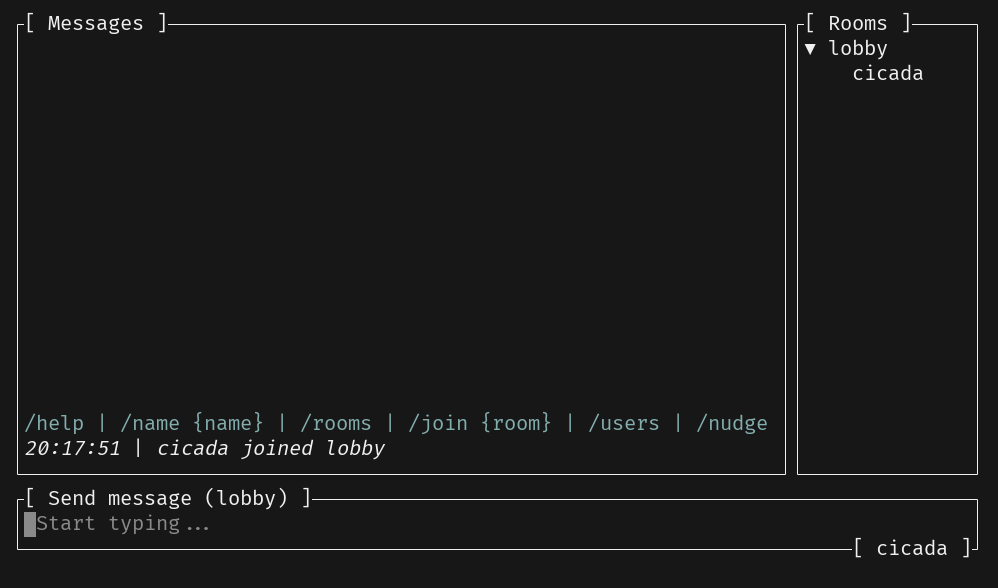

# File Explorer

As you might have realized, the server supports sending/receiving base64 encoded files via `Command::SendFile` and `RoomEvent::File`.

So let's implement a simple file explorer/picker to send files!



## Implementing the Popup

The file explorer will be essentially a popup, similar to the help menu we implemented in the previous chapter.

We will be using the [`ratatui-explorer`](https://github.com/tatounee/ratatui-explorer) crate to do the heavy lifting for us. All we need to do is to refactor our current `src/popup.rs` module to allow different kinds of popups.

Start by adding the dependencies:

```sh
cargo add ratatui-explorer@0.1.2
cargo add base64@0.22.1 # for encoding files
```

You can refactor the `HelpPopup` struct into a more generic `Popup` enum and add a variant for the file explorer:

```diff
+use std::io;
+
+use crossterm::event::Event as CrosstermEvent;
 use ratatui::{
     buffer::Buffer,
     layout::{Constraint, Flex, Layout, Rect},
-    style::{Style, Stylize},
-    widgets::{Block, Clear, Paragraph, Widget, Wrap},
+    style::{Color, Modifier, Style, Stylize},
+    widgets::{Block, BorderType, Clear, Paragraph, Widget, Wrap},
 };
+use ratatui_explorer::{FileExplorer, Theme};
 use tokio::sync::mpsc::UnboundedSender;
 use tui_textarea::{Input, Key};

 use crate::app::Event;

-pub struct HelpPopup {
-    key_bindings: String,
-    event_sender: UnboundedSender<Event>,
+pub enum Popup {
+    Help(String, UnboundedSender<Event>),
+    FileExplorer(FileExplorer, UnboundedSender<Event>),
 }

-impl HelpPopup {
-    pub fn new(key_bindings: String, event_sender: UnboundedSender<Event>) -> Self {
-        Self {
-            key_bindings,
-            event_sender,
-        }
+impl Popup {
+    pub fn help(key_bindings: String, event_sender: UnboundedSender<Event>) -> Self {
+        Self::Help(key_bindings, event_sender)
     }

-    pub async fn handle_input(&mut self, input: Input) -> anyhow::Result<()> {
-        if input.key == Key::Esc {
-            let _ = self.event_sender.send(Event::PopupClosed);
+    pub fn file_explorer(event_sender: UnboundedSender<Event>) -> io::Result<Self> {
+      // TODO
+    }
+
+    pub async fn handle_input(
+        &mut self,
+        input: Input,
+        raw_event: CrosstermEvent,
+    ) -> anyhow::Result<()> {
+        match self {
+            Popup::Help(_, ref event_sender) if input.key == Key::Esc => {
+                let _ = event_sender.send(Event::PopupClosed);
+            }
+            Popup::FileExplorer(ref mut explorer, ref mut event_sender) => match input.key {
+                Key::Esc => {
+                    let _ = event_sender.send(Event::PopupClosed);
+                }
+                Key::Enter => {
+                  // TODO
+                }
+                _ => explorer.handle(&raw_event)?,
+            },
+            _ => {}
         }
         Ok(())
     }
 }

-impl Widget for &mut HelpPopup {
+impl Widget for &mut Popup {
     fn render(self, area: Rect, buf: &mut Buffer) {
-        let popup_area = popup_area(area, 30, 30);
-        Clear.render(popup_area, buf);
-        Paragraph::new(self.key_bindings.trim())
-            .wrap(Wrap { trim: false })
-            .block(
-                Block::bordered()
-                    .title("Help")
-                    .title_style(Style::new().bold()),
-            )
-            .render(popup_area, buf);
+        match self {
+            Popup::Help(ref key_bindings, ..) => render_help(key_bindings, area, buf),
+            Popup::FileExplorer(explorer, _) => render_explorer(area, buf, explorer),
+        }
     }
 }

+fn render_help(key_bindings: &str, area: Rect, buf: &mut Buffer) {
+    let popup_area = popup_area(area, 30, 30);
+    Clear.render(popup_area, buf);
+    Paragraph::new(key_bindings.trim())
+        .wrap(Wrap { trim: false })
+        .block(
+            Block::bordered()
+                .title("Help")
+                .title_style(Style::new().bold()),
+        )
+        .render(popup_area, buf);
+}
+
+fn render_explorer(area: Rect, buf: &mut Buffer, explorer: &mut FileExplorer) {
+ // TODO
+}
+
 fn popup_area(area: Rect, percent_x: u16, percent_y: u16) -> Rect {
     let vertical = Layout::vertical([Constraint::Percentage(percent_y)]).flex(Flex::Center);
     let horizontal = Layout::horizontal([Constraint::Percentage(percent_x)]).flex(Flex::Center);
```

---

🎯 **Task**: Implement the `Popup::file_explorer` method.

```rust
impl Popup {
  pub fn file_explorer(event_sender: UnboundedSender<Event>) -> io::Result<Self> {
    // ...
  }
}
```

💡 **Tip:** You can use the [`FileExplorer::new`](https://docs.rs/ratatui-explorer/latest/ratatui_explorer/struct.FileExplorer.html#method.new) or [`FileExplorer::with_theme`](https://docs.rs/ratatui-explorer/latest/ratatui_explorer/struct.FileExplorer.html#method.with_theme) method to create a new file explorer.

<details>
<summary><b>Solution</b> ✅</summary>

```rust
impl Popup {
    // ...
    pub fn file_explorer(event_sender: UnboundedSender<Event>) -> io::Result<Self> {
        let theme = Theme::default()
            .add_default_title()
            .with_title_bottom(|fe| format!("[ {} files ]", fe.files().len()).into())
            .with_style(Color::Yellow)
            .with_highlight_item_style(Modifier::BOLD)
            .with_highlight_dir_style(Style::new().blue().bold())
            .with_highlight_symbol("> ")
            .with_block(Block::bordered().border_type(BorderType::Rounded));
        let file_explorer = FileExplorer::with_theme(theme)?;
        Ok(Self::FileExplorer(file_explorer, event_sender))
    }
}
```

</details>

---

---

🎯 **Task**: Handle the `Enter` key in the `Popup::handle_input` method when the file explorer is open.

💡 **Tip:** Send the `Event::FileSelected` event when a file is selected and close the popup via `Event::PopupClosed`.

<details>
<summary><b>Solution</b> ✅</summary>

```rust
Key::Enter => {
    let file = explorer.current().clone();
    if file.is_dir() {
        return Ok(());
    }
    let event = Event::FileSelected(file);
    let _ = event_sender.send(event);
    let _ = event_sender.send(Event::PopupClosed);
}
```

</details>

---

---

🎯 **Task**: Implement the `render_explorer` method.

```rust
fn render_explorer(area: Rect, buf: &mut Buffer, explorer: &mut FileExplorer) {
  // ...
}
```

💡 **Tip:** Use `popup_area` to calculate the popup area, similarly to the `render_help` method.

<details>
<summary><b>Solution</b> ✅</summary>

```rust
fn render_explorer(area: Rect, buf: &mut Buffer, explorer: &mut FileExplorer) {
    let popup_area = popup_area(area, 50, 50);
    Clear.render(popup_area, buf);
    explorer.widget().render(popup_area, buf);
}
```

</details>

---

In summary:

- We have added a `Popup::file_explorer` method to create a new `Popup::FileExplorer` variant.
- The `Popup::handle_input` method now takes a `CrosstermEvent` parameter to handle raw events. See the [`handle`](https://docs.rs/ratatui-explorer/latest/ratatui_explorer/struct.FileExplorer.html#method.handle) method of the `FileExplorer` struct for more information.
- We send a `Event::FileSelected` event when a file is selected in the file explorer. (will be implemented in a bit)

## Updating the Application

Let's update our `src/app.rs` to handle the file explorer popup:

```diff
+use base64::prelude::*;
 use common::{Command, RoomEvent, RoomName, ServerEvent, Username};
 use crossterm::event::{Event as CrosstermEvent, EventStream};
 use futures::{SinkExt, StreamExt};
 use ratatui::{style::Style, DefaultTerminal};
+use ratatui_explorer::File;
 use std::net::SocketAddr;
 use tokio::{
     net::{tcp::OwnedWriteHalf, TcpStream},
@@ -11,12 +13,15 @@ use tokio_util::codec::{FramedRead, FramedWrite, LinesCodec};
 use tui_textarea::{Input, Key, TextArea};

 use crate::message_list::MessageList;
-use crate::popup::HelpPopup;
+use crate::popup::Popup;
 use crate::room_list::RoomList;

 const KEY_BINDINGS: &str = r#"
 - [Ctrl + h] Help
 - [Enter] Send message
+- [Ctrl + e] File explorer
+    - [Enter] Select file
+    - [Right/Left] Navigate directories
 - [Esc] Quit
 "#;

@@ -38,12 +43,13 @@ pub struct App {
     pub message_list: MessageList,
     pub room_list: RoomList,
     pub text_area: TextArea<'static>,
-    pub popup: Option<HelpPopup>,
+    pub popup: Option<Popup>,
 }

 #[derive(Clone)]
 pub enum Event {
     Terminal(CrosstermEvent),
+    FileSelected(File),
     PopupClosed,
 }

@@ -104,11 +110,18 @@ impl App {
             Event::Terminal(raw_event) => {
                 let input = Input::from(raw_event.clone());
                 if let Some(ref mut popup) = self.popup {
-                    popup.handle_input(input).await?;
+                    popup.handle_input(input, raw_event).await?;
                     return Ok(());
                 }
                 self.handle_key_input(input).await?;
             }
+            Event::FileSelected(file) => {
+              // TODO
+            }
             Event::PopupClosed => {
                 self.popup = None;
             }
@@ -123,6 +136,7 @@ impl App {
             }
             (_, Key::Enter) => self.send_message().await?,
             (true, Key::Char('h')) => self.show_help(),
+            (true, Key::Char('e')) => self.show_file_explorer()?,
             (_, _) => {
                 let _ = self.text_area.input_without_shortcuts(input);
             }
@@ -144,8 +158,14 @@ impl App {
     }

     fn show_help(&mut self) {
-        let popup = HelpPopup::new(KEY_BINDINGS.to_string(), self.event_sender.clone());
+        let popup = Popup::help(KEY_BINDINGS.to_string(), self.event_sender.clone());
+        self.popup = Some(popup);
+    }
+
+    fn show_file_explorer(&mut self) -> Result<(), anyhow::Error> {
+        let popup = Popup::file_explorer(self.event_sender.clone())?;
         self.popup = Some(popup);
+        Ok(())
     }

     pub async fn handle_server_event(&mut self, event: String) -> anyhow::Result<()> {
```

---

🎯 **Task**: Implement the `Event::FileSelected` event in the `App::handle_event` method.

💡 **Tip:** When a file is selected in the file explorer, we read the file contents, encode it in base64, and send it to the server as a `Command::SendFile` command.

<details>
<summary><b>Solution</b> ✅</summary>

```rust
Event::FileSelected(file) => {
    self.popup = None;
    let contents = tokio::fs::read(file.path()).await?;
    let base64 = BASE64_STANDARD.encode(contents);
    let command = Command::SendFile(file.name().to_string(), base64);
    self.send(command).await;
}
```

</details>

---

## Updating the UI

---

🎯 **Task**: As a final touch, update the `src/message_list.rs` to display a message when a file is sent.

<details>
<summary><b>Solution</b> ✅ ✅</summary>

```diff
+            RoomEvent::File { filename, .. } => Some(Line::from(vec![
+                date.italic(),
+                " | ".into(),
+                Span::from(username).cyan(),
+                " sent a file: ".into(),
+                Span::from(filename).red().magenta(),
+            ])),
             _ => None,
         }
     }
```

</details>

---

Now you can run the TUI and send files to the server! 📁
