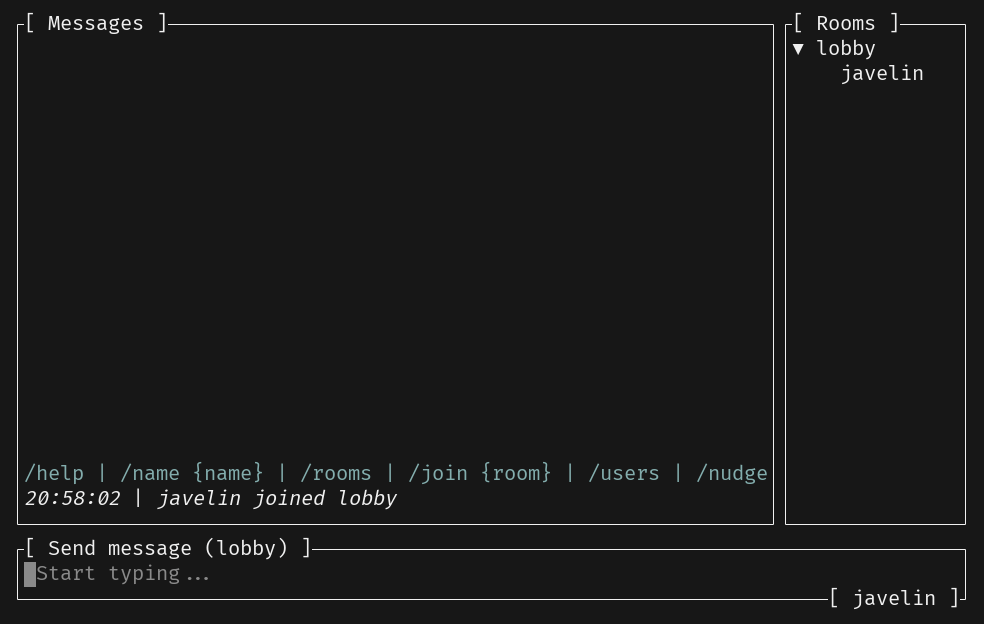

# Image Preview

Wouldn't it be nice to preview the images sent to the chat, right from the terminal? Yup!



We will be implementing this popup and it will be shown when an item in the message list is selected and Ctrl-p is pressed.

## Making MessageList Stateful

Let's start by making the `MessageList` widget stateful:

```diff
     layout::Rect,
     style::{Color, Modifier, Style, Stylize},
     text::{Line, Span},
-    widgets::{Block, List, ListDirection, ListItem, Widget},
+    widgets::{Block, List, ListDirection, ListItem, ListState, StatefulWidget, Widget},
 };

 #[derive(Debug, Clone, Default)]
 pub struct MessageList {
+    pub state: ListState,
     pub events: Vec<ServerEvent>,
     pub room_name: RoomName,
     pub username: Username,
@@ -31,11 +32,17 @@ impl Widget for &mut MessageList {
             .repeat_highlight_symbol(true)
             .direction(ListDirection::BottomToTop);

-        Widget::render(list, area, buf);
+        // TODO: Render the list with state
     }
 }

 impl MessageList {
+    pub fn selected_event(&self) -> Option<ServerEvent> {
+        self.state
+            .selected()
+            .map(|v| self.events[self.events.len() - (v + 1)].clone())
+    }
+
     fn server_event_line<'a>(&self, event: &'a ServerEvent) -> Option<Line<'a>> {
         match event {
             ServerEvent::CommandHelp(_, contents) => Some(Line::from(contents.as_str()).blue()),
```

We can simply depend on [`ListState`](https://docs.rs/ratatui/latest/ratatui/widgets/struct.ListState.html) of Ratatui to allow scrolling and selection of items in the list.

---

🎯 **Task**: Render the List with a state.

💡 **Tip:** `List` is a _StatefulWidget_ :)

<details>
<summary><b>Solution</b> ✅</summary>

```diff
+        StatefulWidget::render(list, area, buf, &mut self.state);
```

</details>

---

To handle the scrolling, we need to update `src/app.rs` as follows:

```diff
 - [Ctrl + e] File explorer
     - [Enter] Select file
     - [Right/Left] Navigate directories
+- [Ctrl + p] Preview file
 - [Esc] Quit
 "#;

@@ -135,8 +136,11 @@ impl App {
                 self.send(Command::Quit).await;
             }
             (_, Key::Enter) => self.send_message().await?,
+            (_, Key::Down) => self.message_list.state.select_previous(),
+            (_, Key::Up) => self.message_list.state.select_next(),
             (true, Key::Char('h')) => self.show_help(),
             (true, Key::Char('e')) => self.show_file_explorer()?,
+            (true, Key::Char('p')) => self.preview_file()?,
             (_, _) => {
                 let _ = self.text_area.input_without_shortcuts(input);
             }
@@ -168,6 +172,20 @@ impl App {
         Ok(())
     }

+    fn preview_file(&mut self) -> Result<(), anyhow::Error> {
+       // ...
+    }
+
     pub async fn handle_server_event(&mut self, event: String) -> anyhow::Result<()> {
         let event = ServerEvent::from_json_str(&event)?;
         self.message_list.events.push(event.clone());
```

You can now press up and down to navigate the message list.

---

🎯 **Task**: Implement the `preview_file` method to show the image preview popup.

```rust
impl App {
    // ...
    fn preview_file(&mut self) -> Result<(), anyhow::Error> {
      // TODO
    }
}
```

💡 **Tip:** Check if the selected event is a `ServerEvent::RoomEvent` with a `RoomEvent::File` variant and set `self.popup` to `Some(_)`

<details>
<summary><b>Solution</b> ✅</summary>

```rust
impl App {
    // ...
    fn preview_file(&mut self) -> Result<(), anyhow::Error> {
        let selected_event = self.message_list.selected_event();
        let event_sender = self.event_sender.clone();
        if let Some(ServerEvent::RoomEvent {
            event: RoomEvent::File { contents, .. },
            ..
        }) = selected_event
        {
            let popup = Popup::image_preview(contents, event_sender)?;
            self.popup = Some(popup);
        }
        Ok(())
    }
}
```

</details>

---

## Rendering Images

Now, onto the main question: how do we render images in the terminal?

There are a couple of protocols for that (sixel, kitty, etc.) and we can also use unicode half-blocks for pixelated images.

Thanks to the [`ratatui-image`](https://github.com/benjajaja/ratatui-image) crate, we don't need to worry much about the details and just use the `StatefulImage` widget that it provides!

```sh
$ cargo add ratatui-image@2.0.1
$ cargo add image@0.25.4 # for image decoding
```

Update the `src/popup.rs` to add a new variant:

```diff
+use base64::{prelude::BASE64_STANDARD, Engine};
 use crossterm::event::Event as CrosstermEvent;
 use ratatui::{
     buffer::Buffer,
     layout::{Constraint, Flex, Layout, Rect},
     style::{Color, Modifier, Style, Stylize},
-    widgets::{Block, BorderType, Clear, Paragraph, Widget, Wrap},
+    widgets::{Block, BorderType, Clear, Paragraph, StatefulWidget, Widget, Wrap},
 };
 use ratatui_explorer::{FileExplorer, Theme};
+use ratatui_image::{picker::Picker, protocol::StatefulProtocol, StatefulImage};
 use tokio::sync::mpsc::UnboundedSender;
 use tui_textarea::{Input, Key};

@@ -16,6 +18,7 @@ use crate::app::Event;
 pub enum Popup {
     Help(String, UnboundedSender<Event>),
     FileExplorer(FileExplorer, UnboundedSender<Event>),
+    ImagePreview(Box<dyn StatefulProtocol>, UnboundedSender<Event>),
 }

 impl Popup {
@@ -36,6 +39,19 @@ impl Popup {
         Ok(Self::FileExplorer(file_explorer, event_sender))
     }

+    pub fn image_preview(
+        contents: String,
+        event_sender: UnboundedSender<Event>,
+    ) -> anyhow::Result<Popup> {
+      // TODO
+    }
+
     pub async fn handle_input(
         &mut self,
         input: Input,
@@ -60,6 +76,9 @@ impl Popup {
                 }
                 _ => explorer.handle(&raw_event)?,
             },
+            Popup::ImagePreview(_, ref event_sender) if input.key == Key::Esc => {
+                let _ = event_sender.send(Event::PopupClosed);
+            }
             _ => {}
         }
         Ok(())
@@ -71,6 +90,7 @@ impl Widget for &mut Popup {
         match self {
             Popup::Help(ref key_bindings, ..) => render_help(key_bindings, area, buf),
             Popup::FileExplorer(explorer, _) => render_explorer(area, buf, explorer),
+            Popup::ImagePreview(ref mut protocol, _) => render_image_preview(area, buf, protocol),
         }
     }
 }
@@ -94,6 +114,12 @@ fn render_explorer(area: Rect, buf: &mut Buffer, explorer: &mut FileExplorer) {
     explorer.widget().render(popup_area, buf);
 }

+fn render_image_preview(area: Rect, buf: &mut Buffer, protocol: &mut Box<dyn StatefulProtocol>) {
+  // TODO
+}
+
 fn popup_area(area: Rect, percent_x: u16, percent_y: u16) -> Rect {
     let vertical = Layout::vertical([Constraint::Percentage(percent_y)]).flex(Flex::Center);
     let horizontal = Layout::horizontal([Constraint::Percentage(percent_x)]).flex(Flex::Center);
```

---

🎯 **Task**: Implement the `image_preview` method in the `Popup` enum.

```rust
impl Popup {
    // ...
    pub fn image_preview(
        contents: String,
        event_sender: UnboundedSender<Event>,
    ) -> anyhow::Result<Popup> {
      // ...
    }
}
```

💡 **Tip:** Decode the base64 encoded image and load it using the `image` crate. Then, create a `Picker` and resize the image using the `new_resize_protocol` method.

<details>
<summary><b>Solution</b> ✅</summary>

```rust
impl Popup {
    // ...
    pub fn image_preview(
        contents: String,
        event_sender: UnboundedSender<Event>,
    ) -> anyhow::Result<Popup> {
        let data = BASE64_STANDARD.decode(contents.as_bytes())?;
        let img = image::load_from_memory(&data)?;
        let user_fontsize = (7, 14);
        let mut picker = Picker::new(user_fontsize);
        picker.guess_protocol();
        let image = picker.new_resize_protocol(img);
        Ok(Popup::ImagePreview(image, event_sender))
    }
}
```

You can see that we are _guessing_ the available protocol for the image and then resizing it when the `Popup::ImagePreview` variant is created. Later on, we create the `StatefulImage` widget and render it in the popup.

</details>

---

---

🎯 **Task**: Implement the `render_image_preview` method.

```rust
fn render_image_preview(area: Rect, buf: &mut Buffer, protocol: &mut Box<dyn StatefulProtocol>) {
    // ...
}
```

💡 **Tip:** This should be similar to the other popups. Use `StatefulImage` widget.

<details>
<summary><b>Solution</b> ✅</summary>

```rust
fn render_image_preview(area: Rect, buf: &mut Buffer, protocol: &mut Box<dyn StatefulProtocol>) {
    let popup_area = popup_area(area, 80, 80);
    let image = StatefulImage::new(None);
    image.render(popup_area, buf, protocol);
}
```

</details>

---

When you run the TUI and press `Ctrl-p` on an image message, you should see the preview of the image! 🖼️
