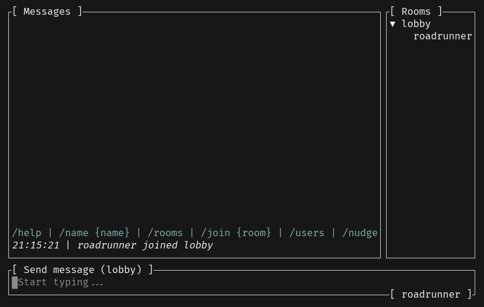

# Markdown Preview

Similar to the image preview, we can also add a markdown preview feature to the application. So if anyone sends a file with a `.md` extension, we can preview it in the terminal.



> [!NOTE] 
> Switch to `chapter-10` branch to get ready for this chapter:
>
> ```sh
> git merge origin/chapter-10
> ```

## Implementing the Popup

Implementing this feature will be quite straightforward thanks to the [`tui-markdown`](https://github.com/joshka/tui-markdown) crate!

So start by adding it:

```sh
cargo add tui-markdown@0.2.12
```

Adding a new popup variant that contains the markdown contents:

```diff
 use crossterm::event::Event as CrosstermEvent;
 use ratatui::{
     buffer::Buffer,
-    layout::{Constraint, Flex, Layout, Rect},
+    layout::{Constraint, Flex, Layout, Offset, Rect},
     style::{Color, Modifier, Style, Stylize},
     widgets::{Block, BorderType, Clear, Paragraph, StatefulWidget, Widget, Wrap},
 };
@@ -19,6 +19,7 @@ pub enum Popup {
     Help(String, UnboundedSender<Event>),
     FileExplorer(FileExplorer, UnboundedSender<Event>),
     ImagePreview(Box<dyn StatefulProtocol>, UnboundedSender<Event>),
+    MarkdownPreview(String, UnboundedSender<Event>),
 }

 impl Popup {
@@ -52,6 +53,17 @@ impl Popup {
         Ok(Popup::ImagePreview(image, event_sender))
     }

+    pub fn markdown_preview(
+        contents: String,
+        event_sender: UnboundedSender<Event>,
+    ) -> anyhow::Result<Popup> {
+      // TODO
+    }
+
     pub async fn handle_input(
         &mut self,
         input: Input,
@@ -79,6 +91,9 @@ impl Popup {
             Popup::ImagePreview(_, ref event_sender) if input.key == Key::Esc => {
                 let _ = event_sender.send(Event::PopupClosed);
             }
+            Popup::MarkdownPreview(_, ref event_sender) if input.key == Key::Esc => {
+                let _ = event_sender.send(Event::PopupClosed);
+            }
             _ => {}
         }
         Ok(())
@@ -91,6 +106,9 @@ impl Widget for &mut Popup {
             Popup::Help(ref key_bindings, ..) => render_help(key_bindings, area, buf),
             Popup::FileExplorer(explorer, _) => render_explorer(area, buf, explorer),
             Popup::ImagePreview(ref mut protocol, _) => render_image_preview(area, buf, protocol),
+            Popup::MarkdownPreview(contents, _) => {
+                render_markdown_preview(area, buf, contents);
+            }
         }
     }
 }
@@ -120,6 +138,17 @@ fn render_image_preview(area: Rect, buf: &mut Buffer, protocol: &mut Box<dyn Sta
     image.render(popup_area, buf, protocol);
 }

+fn render_markdown_preview(area: Rect, buf: &mut Buffer, contents: &str) {
+  // TODO
+}
+
 fn popup_area(area: Rect, percent_x: u16, percent_y: u16) -> Rect {
     let vertical = Layout::vertical([Constraint::Percentage(percent_y)]).flex(Flex::Center);
     let horizontal = Layout::horizontal([Constraint::Percentage(percent_x)]).flex(Flex::Center);
```

---

🎯 **Task**: Implement the `markdown_preview` method.

```rust
impl Popup {
    // ...
    pub fn markdown_preview(
        contents: String,
        event_sender: UnboundedSender<Event>,
    ) -> anyhow::Result<Popup> {
        // ...
    }
}
```

💡 **Tip:** Decode the base64 encoded contents and convert it to a string for constructing the `MarkdownPreview` variant.

<details>
<summary><b>Solution</b> ✅</summary>

```rust
impl Popup {
    // ...
    pub fn markdown_preview(
        contents: String,
        event_sender: UnboundedSender<Event>,
    ) -> anyhow::Result<Popup> {
        let contents = BASE64_STANDARD.decode(contents.as_bytes())?;
        Ok(Popup::MarkdownPreview(
            String::from_utf8(contents)?,
            event_sender,
        ))
    }
}
```

</details>

---

---

🎯 **Task**: Implement the `render_markdown_preview` method.

```rust
fn render_markdown_preview(area: Rect, buf: &mut Buffer, contents: &str) {
  // ...
}
```

💡 **Tip:** Construct a widget using `tui_markdown::from_str` and render it in a popup area.

<details>
<summary><b>Solution</b> ✅</summary>

```rust
fn render_markdown_preview(area: Rect, buf: &mut Buffer, contents: &str) {
    let text = tui_markdown::from_str(contents);
    let mut popup_area = popup_area(area, 80, 80);
    if let (Ok(width), Ok(height)) = (u16::try_from(text.width()), u16::try_from(text.height())) {
        popup_area = popup_area.clamp(Rect::new(popup_area.x, popup_area.y, width + 2, height + 2));
    }
    Clear.render(popup_area, buf);
    Block::bordered().render(popup_area, buf);
    text.render(popup_area.offset(Offset { x: 1, y: 1 }), buf);
}
```

The `tui-markdown` crate renders markdown content in the terminal, calculating the necessary area for display (i.e. `clamp`).

</details>

---

## Showing The Popup

---

🎯 **Task**: Show the markdown preview popup.

💡 **Tip:** Decide between image and markdown preview based on the file extension in the `preview_file` method in `src/app.rs`.

<details>
<summary><b>Solution</b> ✅</summary>

```diff
         let selected_event = self.message_list.selected_event();
         let event_sender = self.event_sender.clone();
         if let Some(ServerEvent::RoomEvent {
-            event: RoomEvent::File { contents, .. },
+            event: RoomEvent::File { filename, contents },
             ..
         }) = selected_event
         {
-            let popup = Popup::image_preview(contents, event_sender)?;
+            let popup = if filename.ends_with("jpg") {
+                Popup::image_preview(contents, event_sender)
+            } else {
+                Popup::markdown_preview(contents, event_sender)
+            }?;
             self.popup = Some(popup);
         }
         Ok(())
```

</details>

---

That's it! You should now be able to preview markdown files that are sent to the chat. 🔥

---

> [!NOTE] 
> Get the completed code for this chapter by running:
>
> ```sh
> git merge origin/chapter-10-solution
> ```

<div style="text-align: right">

Continue to the [next chapter](./11_effects.md) to add cool terminal effects. ➡️

</div>
